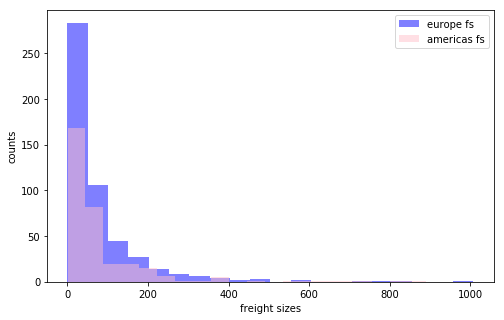
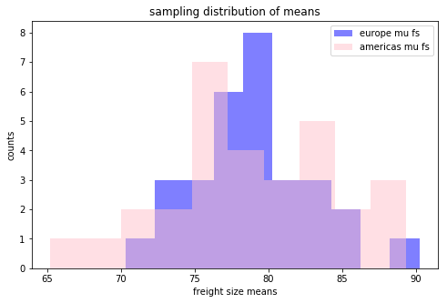

# Schema


# AB Testing
**Netflix**
* Will use Algorithm A for customers {A} and B for customers in {B}
    * what metrics are being tracked
    * if you click on the movie
    * if you watch it
    * if you add it to your list
    * ratings
    * how much of it did you watch? 
* Duration: 30 days
* Run Analysis
* Make an Action Plan

**Facebook**
* Newsfeed Algorithms


**Instagram**
* Feed

**Amazon**
* Recommender Systems

# Objectives
* Answer questions using hypothesis testing
* Draw Action Plans/Recommendations


```python
import sqlite3
import pandas as pd
import numpy as np
import scipy.stats as scs

import matplotlib.pyplot as plt
import seaborn as sns
```


```python
conn = sqlite3.Connection("Northwind_small.sqlite")
```


```python
cur = conn.cursor()
```


```python
# list all the tables of our database
r = cur.execute("select name from sqlite_master where type='table';").fetchall()
r
```


    [('Employee',),
     ('Category',),
     ('Customer',),
     ('Shipper',),
     ('Supplier',),
     ('Order',),
     ('Product',),
     ('OrderDetail',),
     ('CustomerCustomerDemo',),
     ('CustomerDemographic',),
     ('Region',),
     ('Territory',),
     ('EmployeeTerritory',)]


```python
table_names = [t[0] for t in r]
table_names
```


    ['Employee',
     'Category',
     'Customer',
     'Shipper',
     'Supplier',
     'Order',
     'Product',
     'OrderDetail',
     'CustomerCustomerDemo',
     'CustomerDemographic',
     'Region',
     'Territory',
     'EmployeeTerritory']


```python
# let's look at employee, customer and order tables
employee_df = pd.read_sql("select * from employee", conn)
employee_df.head(1)
```


<div>
<style scoped>
    .dataframe tbody tr th:only-of-type {
        vertical-align: middle;
    }

    .dataframe tbody tr th {
        vertical-align: top;
    }

    .dataframe thead th {
        text-align: right;
    }
</style>
<table border="1" class="dataframe">
  <thead>
    <tr style="text-align: right;">
      <th></th>
      <th>Id</th>
      <th>LastName</th>
      <th>FirstName</th>
      <th>Title</th>
      <th>TitleOfCourtesy</th>
      <th>BirthDate</th>
      <th>HireDate</th>
      <th>Address</th>
      <th>City</th>
      <th>Region</th>
      <th>PostalCode</th>
      <th>Country</th>
      <th>HomePhone</th>
      <th>Extension</th>
      <th>Photo</th>
      <th>Notes</th>
      <th>ReportsTo</th>
      <th>PhotoPath</th>
    </tr>
  </thead>
  <tbody>
    <tr>
      <td>0</td>
      <td>1</td>
      <td>Davolio</td>
      <td>Nancy</td>
      <td>Sales Representative</td>
      <td>Ms.</td>
      <td>1980-12-08</td>
      <td>2024-05-01</td>
      <td>507 - 20th Ave. E. Apt. 2A</td>
      <td>Seattle</td>
      <td>North America</td>
      <td>98122</td>
      <td>USA</td>
      <td>(206) 555-9857</td>
      <td>5467</td>
      <td>None</td>
      <td>Education includes a BA in psychology from Col...</td>
      <td>2.0</td>
      <td>http://accweb/emmployees/davolio.bmp</td>
    </tr>
  </tbody>
</table>
</div>


```python
customer_df = pd.read_sql("select * from customer", conn)
customer_df.head(1)
```


<div>
<style scoped>
    .dataframe tbody tr th:only-of-type {
        vertical-align: middle;
    }

    .dataframe tbody tr th {
        vertical-align: top;
    }

    .dataframe thead th {
        text-align: right;
    }
</style>
<table border="1" class="dataframe">
  <thead>
    <tr style="text-align: right;">
      <th></th>
      <th>Id</th>
      <th>CompanyName</th>
      <th>ContactName</th>
      <th>ContactTitle</th>
      <th>Address</th>
      <th>City</th>
      <th>Region</th>
      <th>PostalCode</th>
      <th>Country</th>
      <th>Phone</th>
      <th>Fax</th>
    </tr>
  </thead>
  <tbody>
    <tr>
      <td>0</td>
      <td>ALFKI</td>
      <td>Alfreds Futterkiste</td>
      <td>Maria Anders</td>
      <td>Sales Representative</td>
      <td>Obere Str. 57</td>
      <td>Berlin</td>
      <td>Western Europe</td>
      <td>12209</td>
      <td>Germany</td>
      <td>030-0074321</td>
      <td>030-0076545</td>
    </tr>
  </tbody>
</table>
</div>


```python
order_df = pd.read_sql("select * from [order]", conn)
order_df.head(1)
```


<div>
<style scoped>
    .dataframe tbody tr th:only-of-type {
        vertical-align: middle;
    }

    .dataframe tbody tr th {
        vertical-align: top;
    }

    .dataframe thead th {
        text-align: right;
    }
</style>
<table border="1" class="dataframe">
  <thead>
    <tr style="text-align: right;">
      <th></th>
      <th>Id</th>
      <th>CustomerId</th>
      <th>EmployeeId</th>
      <th>OrderDate</th>
      <th>RequiredDate</th>
      <th>ShippedDate</th>
      <th>ShipVia</th>
      <th>Freight</th>
      <th>ShipName</th>
      <th>ShipAddress</th>
      <th>ShipCity</th>
      <th>ShipRegion</th>
      <th>ShipPostalCode</th>
      <th>ShipCountry</th>
    </tr>
  </thead>
  <tbody>
    <tr>
      <td>0</td>
      <td>10248</td>
      <td>VINET</td>
      <td>5</td>
      <td>2012-07-04</td>
      <td>2012-08-01</td>
      <td>2012-07-16</td>
      <td>3</td>
      <td>32.38</td>
      <td>Vins et alcools Chevalier</td>
      <td>59 rue de l'Abbaye</td>
      <td>Reims</td>
      <td>Western Europe</td>
      <td>51100</td>
      <td>France</td>
    </tr>
  </tbody>
</table>
</div>


# Question1: Does freight size by order vary by largerRegion


```python
order_df.shape
```


    (830, 14)


```python
# unique countries
order_df['ShipRegion'].unique()
```


    array(['Western Europe', 'South America', 'Central America',
           'North America', 'Northern Europe', 'Scandinavia',
           'Southern Europe', 'British Isles', 'Eastern Europe'], dtype=object)


```python
# let's make a new column that is Europe or Americas
order_df['LargerRegion'] = order_df['ShipRegion'].apply(lambda x: 'Americas' if 'America' in x else 'Europe')
order_df.head()
```


<div>
<style scoped>
    .dataframe tbody tr th:only-of-type {
        vertical-align: middle;
    }

    .dataframe tbody tr th {
        vertical-align: top;
    }

    .dataframe thead th {
        text-align: right;
    }
</style>
<table border="1" class="dataframe">
  <thead>
    <tr style="text-align: right;">
      <th></th>
      <th>Id</th>
      <th>CustomerId</th>
      <th>EmployeeId</th>
      <th>OrderDate</th>
      <th>RequiredDate</th>
      <th>ShippedDate</th>
      <th>ShipVia</th>
      <th>Freight</th>
      <th>ShipName</th>
      <th>ShipAddress</th>
      <th>ShipCity</th>
      <th>ShipRegion</th>
      <th>ShipPostalCode</th>
      <th>ShipCountry</th>
      <th>LargerRegion</th>
    </tr>
  </thead>
  <tbody>
    <tr>
      <td>0</td>
      <td>10248</td>
      <td>VINET</td>
      <td>5</td>
      <td>2012-07-04</td>
      <td>2012-08-01</td>
      <td>2012-07-16</td>
      <td>3</td>
      <td>32.38</td>
      <td>Vins et alcools Chevalier</td>
      <td>59 rue de l'Abbaye</td>
      <td>Reims</td>
      <td>Western Europe</td>
      <td>51100</td>
      <td>France</td>
      <td>Europe</td>
    </tr>
    <tr>
      <td>1</td>
      <td>10249</td>
      <td>TOMSP</td>
      <td>6</td>
      <td>2012-07-05</td>
      <td>2012-08-16</td>
      <td>2012-07-10</td>
      <td>1</td>
      <td>11.61</td>
      <td>Toms Spezialitäten</td>
      <td>Luisenstr. 48</td>
      <td>Münster</td>
      <td>Western Europe</td>
      <td>44087</td>
      <td>Germany</td>
      <td>Europe</td>
    </tr>
    <tr>
      <td>2</td>
      <td>10250</td>
      <td>HANAR</td>
      <td>4</td>
      <td>2012-07-08</td>
      <td>2012-08-05</td>
      <td>2012-07-12</td>
      <td>2</td>
      <td>65.83</td>
      <td>Hanari Carnes</td>
      <td>Rua do Paço, 67</td>
      <td>Rio de Janeiro</td>
      <td>South America</td>
      <td>05454-876</td>
      <td>Brazil</td>
      <td>Americas</td>
    </tr>
    <tr>
      <td>3</td>
      <td>10251</td>
      <td>VICTE</td>
      <td>3</td>
      <td>2012-07-08</td>
      <td>2012-08-05</td>
      <td>2012-07-15</td>
      <td>1</td>
      <td>41.34</td>
      <td>Victuailles en stock</td>
      <td>2, rue du Commerce</td>
      <td>Lyon</td>
      <td>Western Europe</td>
      <td>69004</td>
      <td>France</td>
      <td>Europe</td>
    </tr>
    <tr>
      <td>4</td>
      <td>10252</td>
      <td>SUPRD</td>
      <td>4</td>
      <td>2012-07-09</td>
      <td>2012-08-06</td>
      <td>2012-07-11</td>
      <td>2</td>
      <td>51.30</td>
      <td>Suprêmes délices</td>
      <td>Boulevard Tirou, 255</td>
      <td>Charleroi</td>
      <td>Western Europe</td>
      <td>B-6000</td>
      <td>Belgium</td>
      <td>Europe</td>
    </tr>
  </tbody>
</table>
</div>


```python
fs_americas = order_df.loc[order_df['LargerRegion']=='Americas', 'Freight']
fs_europe = order_df.loc[order_df['LargerRegion']=='Europe', 'Freight']
fs_americas.shape, fs_europe.shape
```


    ((325,), (505,))


```python
plt.figure(figsize=(8, 5))
plt.hist(fs_europe, color='blue', alpha=0.5, label='europe fs', bins=20)
plt.hist(fs_americas, color='pink', alpha=0.5, label='americas fs', bins=20)
plt.legend()
plt.xlabel("freight sizes")
plt.ylabel("counts")
plt.show()
```





# Step 1: 
- H0: u_am = u_eu
- HA: u_am != u_eu

# Step 2


```python
fs_am_samps = [np.random.choice(fs_americas, size=325, replace=True).mean() for i in range(30)]
fs_eu_samps = [np.random.choice(fs_europe, size=505, replace=True).mean() for i in range(30)]
```


```python
plt.figure(figsize=(8, 5))
plt.hist(fs_eu_samps, color='blue', alpha=0.5, label='europe mu fs', bins=10)
plt.hist(fs_am_samps, color='pink', alpha=0.5, label='americas mu fs', bins=10)
plt.legend()
plt.title("sampling distribution of means")
plt.xlabel("freight size means")
plt.ylabel("counts")
plt.show()
```





### Test for assumptions of the ttest
* is the data normal
* are the variances equal


```python
# test normality
# H0: data is normal
# HA: data is not normal
fs_am_zscores = scs.zscore(fs_am_samps)
scs.kstest(fs_am_zscores, 'norm', args=(0, 1))

# p>0.05 fail to reject the null which means the data is normal
```


    KstestResult(statistic=0.08497022780141406, pvalue=0.9819029896949801)


```python
# test normality
# H0: data is normal
# HA: data is not normal
fs_eu_zscores = scs.zscore(fs_eu_samps)
scs.kstest(fs_eu_zscores, 'norm', args=(0, 1))

# p>0.05 fail to reject the null which means the data is normal
```


    KstestResult(statistic=0.10210942611209872, pvalue=0.9131984576827601)


#### Data is normal! 


```python
# H0: populations have equal variance
# HA: populations do not have equal variances

scs.bartlett(fs_am_zscores, fs_eu_zscores)
# P = 1.0 which means that the variances are equal
```


    BartlettResult(statistic=0.0, pvalue=1.0)


# Now I can do a Ttest


```python
# H0: fs_mean_am = fs_mean_eu
# HA: fs_mean_am != fs_mean_eu

scs.ttest_ind(fs_am_samps, fs_eu_samps, equal_var=False)

# means are equal
```


    Ttest_indResult(statistic=-0.10639880565036594, pvalue=0.9156639999100907)


# Results
there are no differences between mean freight size between EU and AM.
